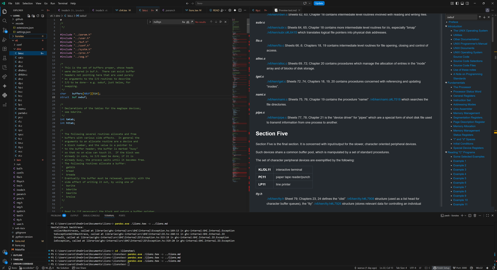

### Getting started
Open this folder in vs code as a project and install the recommended extensions:

- ms-vscode.cpptools
- shd101wyy.markdown-preview-enhanced

TODO: add custom extension to navigate from code to markdown

Open lions.md in Preview and split the editor window

This will give you the ability to read the book and have all the tools of vscode available to explore the code.
- Goto Symbol
- Find References

Eventually you might be able to compile and run this 🚀

# References
## Web Version of the Lions Commentary on Unix
[http://en.wikipedia.org/wiki/Lions'_Commentary_on_UNIX_6th_Edition,_with_Source_Code]()

## HTML Code from
[http://www.tom-yam.or.jp/2238/src/]()

## TEX Code from
[http://www.lemis.com/grog/Documentation/Lions/index.php]()

## Converted TEX-Version to HTML with Plastex
[https://plastex.github.io/plastex/]()

### Open repository in vscodedev (web version of vscode)
[https://vscode.dev/github/warsus/lions-]()
[https://insiders.vscode.dev/github/warsus/lions-]()

